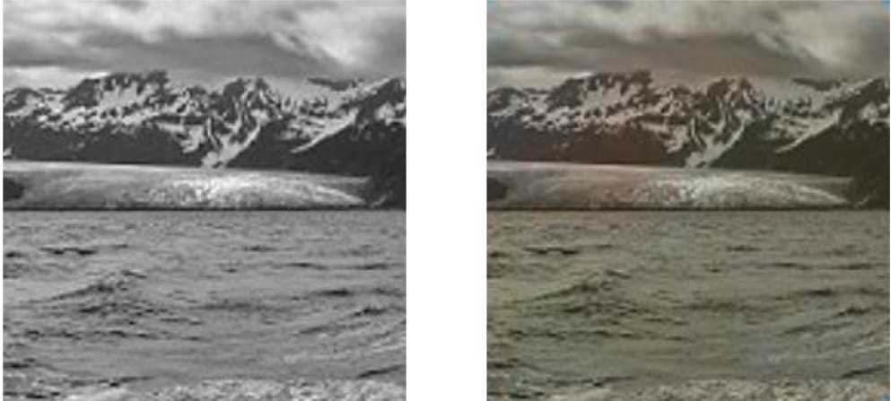
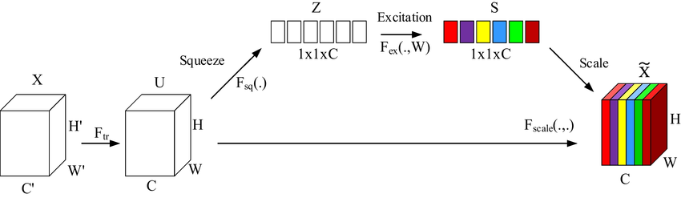
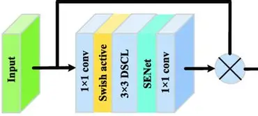
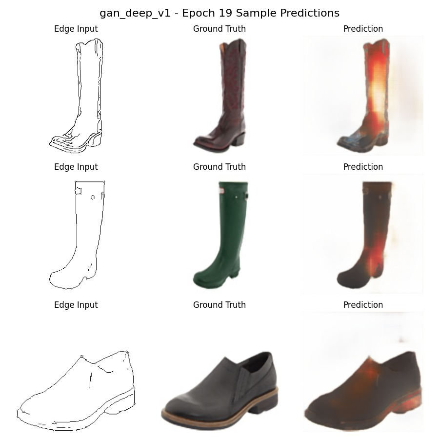

# 🎨 Edge2RGB: Edge-to-Image Generation using Conditional GANs

**NTI Summer Training 2025 — Computer Vision Track**  
Team Members:  
- Youssef Samy Youssef 
- Adham Ashraf Salah
- Abd El-Rahman Farag

---

## 🚀 Project Overview

This project aims to generate realistic RGB images from input edge maps using a Conditional GAN-based model. It was trained on the [edges2shoes dataset](https://www.kaggle.com/datasets/balraj98/edges2shoes-dataset) consisting of 50,000 paired edge and shoe images.

We iteratively improved our models through multiple architectural and loss function upgrades, gradually improving image quality, structure consistency, and color realism.

---

## 📈 Live Demo

🚀 [Live Streamlit Demo](https://ntigpsketchtorgbcolorizing-5wetkghkbr6f7yuez69kcg.streamlit.app/)

---

## 🧠 Project Evolution: Step-by-Step

We progressively enhanced our model through these key stages:

### ✅ Step 1: Basic U-Net
- Started with a simple U-Net architecture.
- Trained using edge images as input and RGB images as output.
- **Result**: Output was overly blurry and lacked color detail.

.jpg)
.jpg)
.jpg)

---

### ✅ Step 2: U-Net + VGG Features (No Discriminator)
- Used a VGG-based feature extractor as perceptual loss.
- **Result**: Outputs were grayscale-like and lacked color diversity.

.jpg)
.jpg)
.jpg)

---

### ✅ Step 3: Basic GAN
- Introduced a basic GAN with a simple discriminator.
- **Result**: Generated images had distorted colors (e.g. red/blue blobs) and corrupted shapes.



---

### ✅ Step 4: Higher Complexity Models on Tom & Jerry Dataset
- Added more layers and complexity.
- **Result**: Model started preserving colors, but hallucinated objects (e.g. cat with red head).

.jpg)
.jpg)
.jpg)

---

### ✅ Step 5: Testing on Masks Dataset
- Switched to a masks-to-image dataset.
- **Result**: Structure preservation improved.

.jpg)
.jpg)
.jpg)

---

### ✅ Step 6: Switched to edges2shoes (50K Images)
- Unified and standardized training on edges2shoes.
- Balanced edge and color information.
- 
.jpg)
.jpg)
.jpg)
- 
---

### ✅ Step 7: Residual + SE Blocks
- Introduced Residual blocks and Squeeze-and-Excitation attention.
- **Result**: More vivid outputs, but burnt (over-saturated) areas appeared occasionally.

.jpg)
.jpg)
.jpg)



---

### ✅ Step 8: SSIM Loss
- Added Structural Similarity Index (SSIM) loss to preserve fine-grained image structure.



---

### ✅ Step 9: White Background Loss
- Added a custom loss term to preserve clean white backgrounds in generated images.

---

### ✅ Step 10: Smarter Discriminator Training
- Applied gradient noise when discriminator was too weak:
```python
if disc_loss > 0.3:
    optimizer.step()
else:
    noise = tf.random.normal(...)
    weights += noise
````

.jpg)
.jpg)
.jpg)

---

### ✅ Step 11: Final GAN Design (Notebook Version)

* Finalized a sophisticated GAN with:

  * Dual-channel input: edges + noise.
  * Enhanced generator with residual and SE blocks.
  * Color preservation loss (in HSV space).
  * Perceptual loss.
  * SSIM and L1.
  * Gradient penalty and noise injection for discriminator.
* **Result**: Stable training, realistic colors, sharp structures.

.jpg)
.jpg)
.jpg)

---

## 🛠️ Architecture Summary

### Generator Highlights

* U-Net backbone.
* 2-channel input (edge + noise).
* Residual + SE attention blocks.
* Dual-output head (structure + color refine).
* Tanh activation for \[-1, 1] image output.

### Discriminator Highlights

* PatchGAN-style architecture.
* Gradual downsampling with Dropout and BatchNorm.
* LSGAN loss with noise injection.

---

## 📊 Training Strategy

* **Losses used**:

  * L1 (Pixel-wise accuracy)
  * SSIM (Structural integrity)
  * Color preservation (HSV-based)
  * Perceptual (channel-wise statistics)
  * White background loss
  * GAN loss (LSGAN)
* **Training tricks**:

  * Conditional edge input.
  * Dynamic discriminator updates.
  * Gradient penalty.
  * Custom augmentation.
  * Data generators with shared caching.

---

## 📂 Dataset

* [edges2shoes dataset](https://www.kaggle.com/datasets/balraj98/edges2shoes-dataset)

---

## 📷 Visual Results

.png)
.png)
.png)
.png)
.png)
.png)
.png)
.png)

* Input edge + noise
* Ground truth RGB
* Model output
* Color difference heatmap

---

## 📁 Files

* `train-nb.ipynb`: Final training notebook.
* `CustomModel`: Wrapper for training, saving, loss management.
* `MyDataGenerator`: Augmentation and caching logic.
* `build_generator` / `build_discriminator`: Model definitions.

---

## 🙏 Acknowledgements

* **Special thanks to Eng. Kholoud** — our dedicated instructor and mentor throughout the NTI Summer Training journey.
* NTI Summer Internship 2025
* Kaggle for dataset hosting
* TensorFlow / Keras team

---

## 📌 Future Work

* Extend to sketch-to-face or edge-to-anime generation.
* Train on higher resolution images (e.g. 512x512).
* Real-time demo deployment using Streamlit or Gradio.

---

## 📬 Contact

For questions or collaborations, feel free to reach out:

* Youssef Samy — https://www.linkedin.com/in/yosef0samy
* Adham Ashraf Salah — https://www.linkedin.com/in/adham-ashraf-01aa8432a/
* Abd El-Rahman Farag — https://www.linkedin.com/in/abdulrahman-farag-a7715a351?utm_source=share&utm_campaign=share_via&utm_content=profile&utm_medium=android_app
